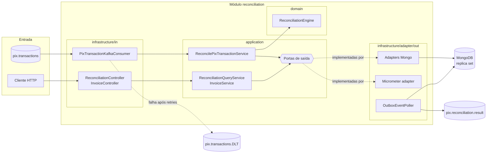
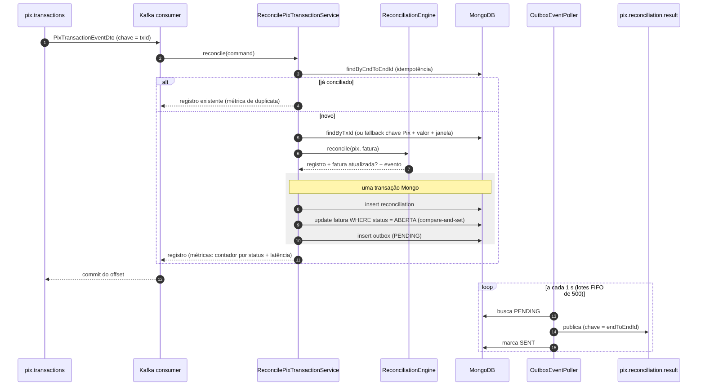

# Conciliação Automática de Pagamentos Pix

> Case técnico — Engenharia de Software Backend (Itaú).

Sistema que consome transações Pix em tempo real (via Kafka/Redpanda), associa cada uma a uma fatura existente e
classifica o resultado como **CONCILIADO**, **PENDENTE** ou **INCONSISTENTE**, publicando o resultado como evento e
expondo relatórios via API REST.

---

## Sumário

1. [Visão geral da solução](#1-visão-geral-da-solução)
2. [Arquitetura](#2-arquitetura)
3. [Regras de conciliação](#3-regras-de-conciliação)
4. [Como executar](#4-como-executar)
5. [API REST](#5-api-rest)
6. [Mensageria e contratos de eventos](#6-mensageria-e-contratos-de-eventos)
7. [Resiliência e confiabilidade](#7-resiliência-e-confiabilidade)
8. [Escalabilidade, latência e vazão](#8-escalabilidade-latência-e-vazão)
9. [Segurança e LGPD](#9-segurança-e-lgpd)
10. [Observabilidade](#10-observabilidade)
11. [Estratégia de testes](#11-estratégia-de-testes)
12. [Decisões técnicas e trade-offs](#12-decisões-técnicas-e-trade-offs)
13. [Limitações e evoluções](#13-limitações-e-evoluções)
14. [Uso de IA](#14-uso-de-ia)

---

## 1. Visão geral da solução

| Requisito do case | Como é atendido |
|---|---|
| Consumir fluxo de transações Pix em tempo real | Consumer Kafka (`pix.transactions`), 6 partições / 6 threads (configurável) |
| Associar transação a pedido/fatura | Motor de conciliação de domínio: por `txId`; fallback por chave Pix + valor + janela de tempo |
| Detectar e reportar não conciliadas/divergentes | Status `PENDENTE` / `INCONSISTENTE` com motivo; evento em `pix.reconciliation.result`; API de consulta |
| Relatórios simples por status | `GET /api/v1/reconciliations/summary` e listagem filtrável |
| Escalável e tolerante a falhas | Particionamento Kafka, consumidor idempotente, outbox transacional, retry + DLQ |
| Latência ≤ 2 s | **100 % das conciliações em ≤ 2 s** com carga abaixo da capacidade (p99 ≈ 0,7 s) — ver [seção 8](#8-escalabilidade-latência-e-vazão) |

**Stack**: Java 25 · Spring Boot 4.1 · Spring Modulith 2.1 · MongoDB 7 (replica set) · Redpanda (API Kafka) ·
Micrometer/Prometheus · springdoc-openapi · Testcontainers · Docker Compose.

---

## 2. Arquitetura

**Monólito modular + arquitetura hexagonal (ports & adapters).** O domínio (`domain/`) não conhece Spring, Mongo nem
Kafka; a aplicação (`application/`) orquestra casos de uso via portas; a infraestrutura (`infrastructure/`) implementa
os adapters de entrada (Kafka, REST) e saída (Mongo, Kafka, métricas). As regras de dependência são **verificadas por
teste** (`ModularityTest` com Spring Modulith e `HexagonalArchitectureTest` com ArchUnit).

```
reconciliation/
├── domain/          # ReconciliationEngine, Invoice, ReconciliationRecord, value objects, eventos (sealed)
├── application/     # casos de uso (port/in), portas de saída (port/out), serviços, modelos de leitura
└── infrastructure/
    ├── in/          # Kafka consumer, REST controllers, OpenAPI, tratamento de erros (ProblemDetail)
    └── adapter/out/ # Mongo (persistência, consultas, outbox), Kafka (relay do outbox), Micrometer (métricas)
```

### Componentes



### Fluxo de conciliação



O diagrama de módulos gerado a partir do código pelo Spring Modulith (PlantUML/C4) fica em
`target/spring-modulith-docs/` após `mvn test` (`ModularityTest`).

---

## 3. Regras de conciliação

1. **Idempotência**: se já existe conciliação para o `endToEndId`, retorna o registro existente (nada é reprocessado).
2. **Com `txId`**: busca a fatura pelo `txId`.
3. **Sem `txId`**: fallback por **chave Pix + valor + janela de ±30 min** entre faturas `ABERTA`.
   - 1 candidata → segue para o motor; mais de 1 → `INCONSISTENTE / MULTIPLE_INVOICES_MATCHED`.
4. **Motor** (`ReconciliationEngine`, domínio puro):

| Situação da fatura | Resultado | Motivo | Efeito na fatura |
|---|---|---|---|
| Não encontrada | `PENDENTE` | — | — |
| Já paga | `INCONSISTENTE` | `INVOICE_ALREADY_PAID` | — |
| Aberta, porém vencida | `INCONSISTENTE` | `INVOICE_EXPIRED` | `ABERTA → EXPIRADA` |
| Já expirada | `INCONSISTENTE` | `INVOICE_EXPIRED` | — |
| Cancelada | `INCONSISTENTE` | `INVOICE_CANCELLED` | — |
| Valor divergente | `INCONSISTENTE` | `AMOUNT_MISMATCH` | — |
| Aberta e valor confere | `CONCILIADO` | — | `ABERTA → PAGA` |

---

## 4. Como executar

**Pré-requisitos**: Docker + Docker Compose, Java 25, Maven 3.9+.

```bash
# 1. Infraestrutura (Redpanda, Redpanda Console, MongoDB em replica set)
docker compose up -d
docker compose ps            # mongo-init deve ter finalizado com exit code 0

# 2. Aplicação
mvn spring-boot:run

# 3. Testes
mvn test                     # unitários + arquitetura (não requer Docker)
mvn verify                   # + integração com Testcontainers (requer Docker)
```

| Serviço | URL |
|---|---|
| API | http://localhost:8081/api/v1 |
| Swagger UI | http://localhost:8081/swagger-ui.html |
| OpenAPI (JSON) | http://localhost:8081/v3/api-docs |
| Health / métricas | http://localhost:8081/actuator/health · `/actuator/metrics` · `/actuator/prometheus` |
| Redpanda Console | http://localhost:8080 |

### Passo a passo rápido

```bash
# 1. Abrir uma fatura
curl -X POST http://localhost:8081/api/v1/invoices -H "Content-Type: application/json" \
  -d '{"txId":"TX123","amount":150.00,"pixKey":"user@email.com","expiresAt":"2026-12-31T23:59:59Z"}'

# 2. Publicar o Pix correspondente (chave da mensagem = txId)
echo 'TX123 {"endToEndId":"E0000000020260923120000000000001","txId":"TX123","transactionAmount":150.00,"paymentTimestamp":"2026-09-23T12:00:00Z","pixKey":"user@email.com"}' \
  | docker exec -i redpanda rpk topic produce pix.transactions -f '%k %v\n'

# 3. Consultar o resultado e a fatura
curl http://localhost:8081/api/v1/reconciliations/E0000000020260923120000000000001
curl http://localhost:8081/api/v1/invoices/TX123           # status PAGA, chave Pix mascarada
```

O roteiro completo da apresentação (os três status ao vivo, mensagem inválida no DLT, carga) está em
[docs/ROTEIRO-DEMO.md](docs/ROTEIRO-DEMO.md).

### Teste de carga

Com a infraestrutura e a aplicação no ar:

```bash
# Burst: 5.000 mensagens o mais rápido possível
mvn -q test-compile exec:java -Dexec.classpathScope=test \
    -Dexec.mainClass=br.com.desafio.conciliacaopix.loadtest.PixLoadDemo -Dexec.args=5000

# Ritmo constante (ex.: 200 msg/s) — latência com chegada abaixo da capacidade
mvn -q test-compile exec:java -Dexec.classpathScope=test \
    -Dexec.mainClass=br.com.desafio.conciliacaopix.loadtest.PixLoadDemo -Dexec.args=5000 -Dloadtest.rate=200
```

O gerador fica em `src/test/java/.../loadtest/` (nunca vai para o jar). Ele cria as faturas pela API, publica as
mensagens com um `KafkaProducer` puro, espera a conciliação e imprime a tabela **esperado × obtido**, as mensagens no
DLT e a latência (p50/p95/p99 e % dentro do SLO de 2 s). O resultado está na [seção 8](#8-escalabilidade-latência-e-vazão).

---

## 5. API REST

Documentação interativa em `/swagger-ui.html`. Erros no formato **ProblemDetail (RFC 9457)**; erros de validação
(corpo ou query params) trazem a lista de violações — sem ecoar o valor rejeitado, que pode conter dado pessoal:

```json
{
  "title": "Requisição inválida",
  "status": 400,
  "detail": "2 campos inválidos.",
  "instance": "/api/v1/invoices",
  "errors": [
    { "field": "amount", "message": "deve ser maior que 0" },
    { "field": "txId", "message": "deve ter de 1 a 35 caracteres alfanuméricos" }
  ]
}
```

| Método | Endpoint | Descrição |
|---|---|---|
| GET | `/api/v1/reconciliations/{endToEndId}` | Conciliação de uma transação (200 / 400 / 404) |
| GET | `/api/v1/reconciliations?status&reason&from&to&page&size` | Listagem paginada e filtrável (`size` ≤ 100) |
| GET | `/api/v1/reconciliations/summary?from&to` | Relatório: quantidade e valor por status; motivos das inconsistências |
| POST | `/api/v1/invoices` | Abre fatura (201 / 400 / 409) |
| GET | `/api/v1/invoices/{txId}` | Consulta fatura (chave Pix mascarada) |

---

## 6. Mensageria e contratos de eventos

| Tópico | Papel | Partições |
|---|---|---|
| `pix.transactions` | Entrada: transações Pix recebidas, chave = `txId` | 6 (`PIX_PARTITIONS`) |
| `pix.transactions.DLT` | Dead-letter: mensagens que falharam após as retentativas (mesma partição da origem) | igual à entrada |
| `pix.reconciliation.result` | Saída: resultado da conciliação (via outbox), chave = `endToEndId` | 6 |

**Chave de particionamento da entrada = `txId`**: todos os pagamentos de uma fatura caem na mesma partição, em ordem —
por exemplo, o segundo pagamento de uma fatura é sempre processado depois do primeiro.

Mensagem de entrada:

```json
{
  "endToEndId": "E0000000020260919123456789012345",
  "txId": "TX123",
  "transactionAmount": 150.00,
  "paymentTimestamp": "2026-09-23T13:45:10Z",
  "pixKey": "user@email.com"
}
```

Eventos de saída (`PixReconciledEvent`, `PixPendingEvent`, `PixInconsistentEvent`), todos com `transactionAmount`.
Exemplo de inconsistência:

```json
{
  "reconciliationId": "019983c0-7a1e-7c3a-9f1e-2b8d4f6a1c55",
  "endToEndId": { "value": "E0000000020260919123456789012345" },
  "txId": { "value": "TX123" },
  "transactionAmount": { "value": 149.90 },
  "expectedAmount": { "value": 150.00 },
  "reason": "AMOUNT_MISMATCH",
  "occurredOn": "2026-09-23T13:45:10.512Z"
}
```

**Nota sobre o contrato**: hoje o evento de domínio é serializado diretamente, então os value objects aparecem como
`{"value": ...}` e o tipo do evento não vai no payload. Para um contrato público, a evolução é um **DTO de integração
versionado** (campos planos, `eventType`, `schemaVersion`) com schema registry — assim o modelo de domínio pode mudar
sem quebrar consumidores.

---

## 7. Resiliência e confiabilidade

Implementada **somente com mecanismos nativos do ecossistema Spring** (sem Resilience4j — ver trade-offs).

| Falha / risco | Mecanismo | Onde |
|---|---|---|
| Mensagem duplicada (redelivery) | **Idempotent Consumer**: verificação prévia por `endToEndId` + índice único como última barreira | `ReconcilePixTransactionService`, `ReconciliationDocument` |
| Dual-write (Mongo + Kafka) | **Transactional Outbox**: registro + fatura + evento na mesma transação Mongo; relay publica depois | `ReconciliationMongoAdapter`, `OutboxEventPoller` |
| Dois pagamentos concorrentes para a mesma fatura | **Compare-and-set**: update condicionado a `status = ABERTA`; se não casar → rollback + retry → `INVOICE_ALREADY_PAID` | `ReconciliationMongoAdapter` |
| Falha transitória no processamento | Retry do consumer (`DefaultErrorHandler`, 3 tentativas, backoff fixo de 1 s) | `KafkaConsumerConfig` |
| Mensagem envenenada / irrecuperável | **Dead-letter topic** após as retentativas; erro de desserialização vai direto | `KafkaConsumerConfig` |
| Broker indisponível na publicação do resultado | Outbox permanece `PENDING`; relay reenvia no próximo ciclo (lotes FIFO, timeout explícito) | `OutboxEventPoller` |

Garantia de entrega do resultado: **at-least-once** (consumidores do tópico de resultado devem ser idempotentes por
`endToEndId`).

**Por que o `DuplicateKeyException` não é capturado dentro da transação.** No MongoDB, um erro de escrita dentro de
uma transação multi-documento **aborta a transação inteira** — capturar a exceção e seguir faria o `commit` falhar
depois, a mensagem voltaria para retry e acabaria no DLT. Por isso a idempotência é feita **antes** da transação
(`findByEndToEndId`, retorna o registro existente). Se duas entregas da mesma mensagem correrem em paralelo, o índice
único faz a segunda transação falhar e ser desfeita; no retry do Kafka, a verificação prévia já encontra o registro e
encerra sem erro. O mesmo raciocínio vale para o compare-and-set da fatura (`OptimisticLockingFailureException` →
rollback → retry → o motor enxerga `PAGA` → `INVOICE_ALREADY_PAID`).

Esses comportamentos são verificados contra MongoDB e Redpanda reais em `ReconciliationFlowIT` (inclusive que o
rollback do compare-and-set desfaz também o registro e a linha do outbox gravados antes do update).

---

## 8. Escalabilidade, latência e vazão

NFRs do case: latência ≤ 2 s; 2.000 TPS em média, picos de 7.000 TPS. O case deixa claro que não se espera uma
implementação completa de produção; aqui a vazão é **medida** num único nó e o caminho até o NFR é **argumentado**.

### Resultados medidos

Ambiente: 1 instância da aplicação, MongoDB e Redpanda de um nó cada em Docker Desktop (Windows), mesmo notebook.
Cada rodada: 4.000 faturas criadas pela API + 5.000 mensagens Pix no mix abaixo.

| Cenário (5.000 msgs) | % | Resultado esperado |
|---|---|---|
| Conciliação por `txId` | 65 | `CONCILIADO` |
| Valor divergente | 10 | `INCONSISTENTE / AMOUNT_MISMATCH` |
| Segundo pagamento da mesma fatura | 5 | `INCONSISTENTE / INVOICE_ALREADY_PAID` |
| `txId` desconhecido | 10 | `PENDENTE` |
| Sem `txId` (fallback por chave Pix) | 5 | `CONCILIADO` |
| Reentrega (mesmo `endToEndId`) | 5 | nenhum registro novo |

| Rodada | Consumo | Vazão fim a fim | Latência p50 / p95 / p99 | ≤ 2 s | Esperado × obtido |
|---|---|---|---|---|---|
| **Ritmo constante, 200 msg/s** | 6 partições × 6 threads | 186 conciliações/s (= taxa de chegada) | **50 ms / 492 ms / 676 ms** | **100 %** | 10/10 OK |
| Burst (5.000 msgs em 0,24 s) | 6 × 6 | ~300 conciliações/s | 7,0 s / 14,2 s / 15,4 s | 14,8 % | 10/10 OK |
| Burst | 12 × 12 | ~318 conciliações/s | 7,4 s / 13,3 s / 14,1 s | 9,5 % | 10/10 OK |

Latência medida de `paymentTimestamp` até a conciliação persistida (timer `pix.reconciliation.latency`); percentis
estimados a partir do histograma exportado no `/actuator/prometheus`. Em todas as rodadas: 4.750 conciliações
(5.000 − 250 reentregas), 3.500 faturas `PAGA`, faturas divergentes continuam `ABERTA`, **0 mensagens no DLT**.
Produção das mensagens: ~20.000 msg/s (o gerador não é o gargalo).

### Leitura dos números

- **Abaixo da capacidade, o NFR de 2 s é atendido com folga** (p99 ≈ 0,7 s). No burst, a latência é quase toda
  **tempo de fila**: 5.000 mensagens chegam em 0,24 s e são drenadas a ~300/s — a mensagem de número 5.000 espera
  ~15 s por construção.
- **A capacidade de um nó neste ambiente é ~300 conciliações/s.** Dobrar partições e threads (12 × 12) **não** aumentou
  a vazão: o gargalo não é o paralelismo do consumer, e sim o custo por mensagem no MongoDB — 2 leituras + uma
  transação com 3 escritas e commit com journal, num único nó em Docker Desktop, mais as escritas do relay do outbox
  (`saveAll` = uma escrita por evento).
- **Corretude sob carga**: esperado = obtido em todas as rodadas, inclusive reentregas e segundos pagamentos
  concorrentes.

### Argumento de escala até 2.000–7.000 TPS

- **Paralelismo = partições.** Escala horizontal adicionando instâncias ao mesmo consumer group até o nº de partições;
  dimensionar partições para o pico (ex.: 7.000 TPS ÷ vazão medida por partição, com folga). Partições e threads já
  são configuráveis (`PIX_PARTITIONS`, `PIX_CONCURRENCY`).
- **Mas o teste mostra que o próximo gargalo é o banco**, então escalar consumers sozinho não basta:
  - MongoDB em **cluster sharded** (chave hash em `txId`/`endToEndId`), em hardware dedicado — o nó único em Docker
    Desktop é o pior caso;
  - **listener em lote + bulk writes** (um round-trip para N mensagens em vez de ~6 por mensagem);
  - relay do outbox com **update em lote** (`updateMulti` por `_id IN (...)`) e, em volume maior, **CDC**
    (change streams / Debezium) no lugar de polling;
  - revisar write concern/journal conforme o requisito de durabilidade.
- **Chave por `txId`** preserva a ordem por fatura mesmo com muitas partições; risco de hot key é desprezível (uma
  fatura ≈ um pagamento).

---

## 9. Segurança e LGPD

- **Minimização**: o registro de conciliação não armazena a chave Pix; a API de faturas devolve a chave **mascarada**.
- **Logs sem dados pessoais**: os logs da aplicação registram `endToEndId`/`txId` (identificadores técnicos da
  transação), nunca a chave Pix; o log por mensagem fica em `DEBUG`. Ponto de atenção: ao esgotar as retentativas, o
  `DefaultErrorHandler` do spring-kafka loga o `ConsumerRecord` com o payload (que contém a chave Pix) — em produção,
  customizar esse log para registrar só tópico/partição/offset/chave.
- **Sem autenticação na API nesta versão** — trade-off consciente (ver seção 12). Proposta: OAuth2/OIDC (ex.: Keycloak)
  para a API de relatórios com papéis de leitura; mTLS/SASL entre serviços e broker.
- **MongoDB local sem `--auth`/`--keyFile`** para simplificar o ambiente de desenvolvimento; em produção: autenticação,
  TLS e criptografia em repouso.
- **Evoluções**: criptografia de campo para a chave Pix na fatura (Queryable Encryption / CSFLE do MongoDB, que ainda
  permite o fallback por igualdade); política de retenção (ex.: índice TTL para registros de conciliação e outbox
  após o prazo regulatório); Swagger UI desabilitado em produção.

---

## 10. Observabilidade

- Spring Boot Actuator: `health`, `info`, `metrics`, `prometheus`.
- **Métricas de negócio (Micrometer)**, publicadas pelo adapter `MicrometerReconciliationMetricsAdapter` atrás da porta
  `ReconciliationMetricsPort` (a aplicação continua sem dependência de framework):

| Métrica | Tipo | Tags | Uso |
|---|---|---|---|
| `pix.reconciliation.total` | contador | `status`, `reason` | volume por resultado; taxa de `INCONSISTENTE` |
| `pix.reconciliation.latency` | timer (histograma + SLO de 2 s) | — | NFR de latência: `paymentTimestamp` → conciliação persistida |
| `pix.reconciliation.duplicates` | contador | — | reentregas absorvidas pela idempotência |

  Registrada **após** o commit da transação — só conta o que foi efetivamente persistido; duplicatas não entram no
  contador por status nem no timer.

- **Indicadores e alertas propostos**: latência p99 > 2 s (ou `le="2.0"` / total < 99 %); lag do consumer group
  crescendo; qualquer mensagem no DLT; idade do evento `PENDING` mais antigo no outbox; taxa de `INCONSISTENTE` fora
  do padrão; health do Mongo/Kafka.
- Stack Grafana/OpenTelemetry e correlação de logs (MDC com `endToEndId`) não implementadas — ver trade-offs.

---

## 11. Estratégia de testes

| Camada | Tipo | O que cobre |
|---|---|---|
| Domínio | Unitário puro (sem Spring) | Motor de conciliação (todas as regras), `Invoice`, value objects |
| Aplicação | Unitário com Mockito | Orquestração (txId, fallback, ambiguidade, idempotência, métricas após persistir), relatório, faturas |
| Adapters | Unitário com mocks | Compare-and-set da fatura, relay do outbox (sucesso, falha parcial, timeout, drenagem em lotes), métricas, mapeamentos |
| Web | MockMvc standalone | Status HTTP, validação, ProblemDetail, mascaramento |
| Arquitetura | Spring Modulith + ArchUnit | Fronteiras de módulo; domínio sem framework; aplicação sem infraestrutura |
| Integração | **Testcontainers** (MongoDB replica set + Redpanda) | Fluxo ponta a ponta até o tópico de resultado; idempotência; DLT; rollback real do compare-and-set |
| Carga | Gerador de burst / ritmo constante | Vazão, latência, contagens esperado × obtido |

Execução: `mvn test` → 102 testes unitários e de arquitetura (não requer Docker). `mvn verify` → + 4 testes de
integração (`*IT`, via failsafe; requer Docker).

---

## 12. Decisões técnicas e trade-offs

| Decisão | Motivo | Custo / alternativa |
|---|---|---|
| Monólito modular (Spring Modulith) + hexagonal | Entrega viável no prazo com fronteiras claras; domínio testável sem infra | Microsserviços: deploy/escala independentes, mas alto custo operacional para o escopo |
| MongoDB (replica set) | Transações multi-documento (registro + fatura + outbox atômicos), agregações para o relatório, esquema flexível para evoluir o registro e **sharding horizontal nativo** para o volume do NFR | Relacional (PostgreSQL): ACID e constraints mais ricos, mas a escala de escrita exige particionamento/sharding externo; transações Mongo têm custo maior que escritas simples (visível no teste de carga) |
| Redpanda | API Kafka, binário único, leve para dev | Em produção: Kafka gerenciado (ex.: MSK) — código não muda |
| Outbox por polling | Simples, sem infraestrutura extra | CDC (Debezium / change streams) em volumes maiores; múltiplas instâncias do relay publicam duplicados (at-least-once) |
| Idempotência por verificação + índice único | Sem tabela de inbox extra | Inbox dedicada permitiria auditoria de mensagens recebidas |
| Sem Resilience4j | Prazo; os mecanismos nativos cobrem retry, DLQ, timeout, idempotência | Circuit breaker desnecessário: não há dependência externa síncrona instável no escopo |
| Sem Keycloak / controle de acesso | Prazo | Proposta na seção 9 |
| Sem GraalVM Native Image | Custo de configuração (reflection, Kafka/Mongo) × ganho de startup/memória | Evolução para ambientes com scale-to-zero |
| Sem Grafana/OpenTelemetry | Prazo; Actuator + endpoint Prometheus já expõem as métricas | Tracing distribuído e dashboards como evolução |
| Sem correlação de logs (MDC) | Prazo; cortado na priorização final | MDC com `endToEndId` no consumer (e propagado via header Kafka) |
| Demonstração de vazão por burst + ritmo constante | Um notebook não representa um cluster; medição honesta + argumento de escala | Teste de carga sustentado em ambiente dimensionado |
| Mongo local sem autenticação | Replica set + auth exige `--keyFile`; simplifica o dev | Autenticação, TLS e keyfile em qualquer ambiente real |

---

## 13. Limitações e evoluções

- Pix `PENDENTE` não é reprocessado quando a fatura chega depois → job/evento de reconciliação tardia (o
  reprocessamento precisa contornar a idempotência por `endToEndId`, que hoje devolve o registro existente).
- Mensagens no DLT não têm reprocessamento automatizado → ferramenta de replay com correção.
- Registros `SENT` do outbox não são expurgados → índice TTL em `sentAt`.
- Contrato de evento acoplado ao modelo de domínio → DTO de integração versionado / schema registry.
- **Vazão de um nó (~300/s no ambiente de teste) limitada pelo MongoDB**, não pelo consumer → listener em lote + bulk
  writes, update em lote no relay do outbox, sharding (ver seção 8).
- As fábricas Kafka customizadas (consumer, DLT, outbox) são montadas a partir de `KafkaProperties` e **não usam os
  `ConnectionDetails` do Spring Boot** — nos testes de integração o broker é injetado por
  `spring.kafka.bootstrap-servers`; evolução: construir as fábricas a partir de `KafkaConnectionDetails`.
- Sem correlação de logs por `endToEndId` (MDC).

---

## 14. Uso de IA

Detalhado em [docs/USO-DE-IA.md](docs/USO-DE-IA.md): em que momentos, para quê e o que foi decisão/implementação própria.