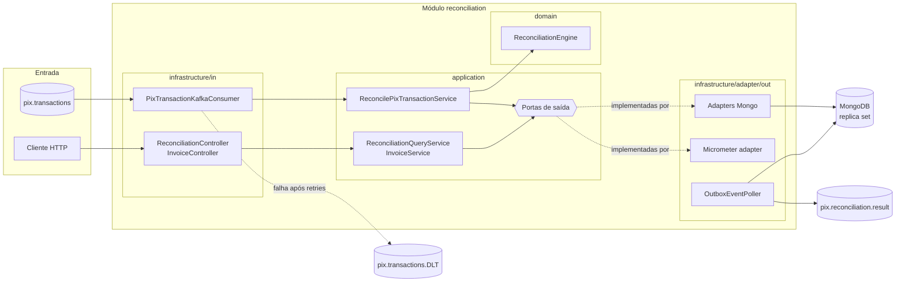
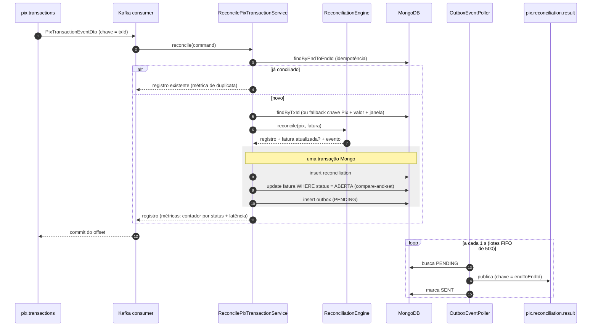
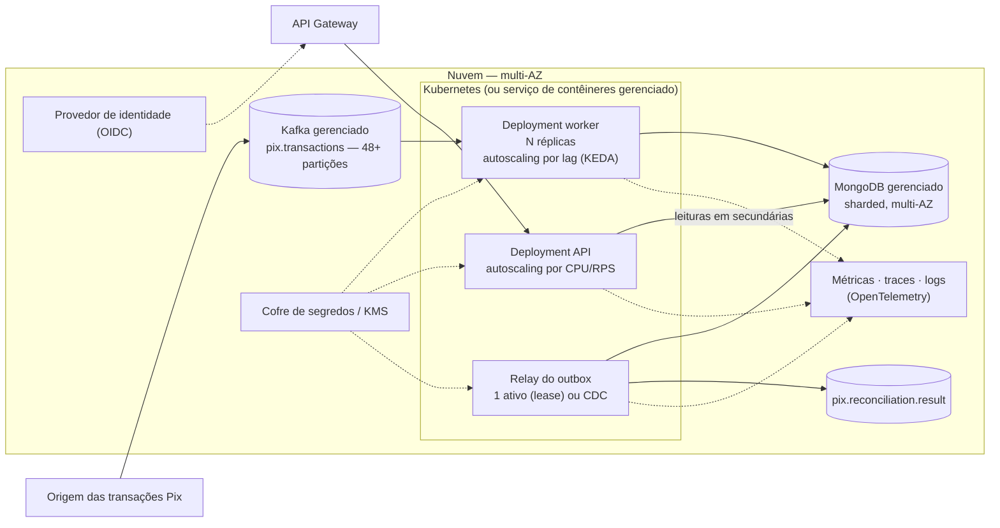

# Conciliação Automática de Pagamentos Pix

> Case técnico — Engenharia de Software Backend (Itaú).

Sistema que consome transações Pix em tempo real (via Kafka/Redpanda), associa cada uma a uma fatura existente e
classifica o resultado como **CONCILIADO**, **PENDENTE** ou **INCONSISTENTE**, publicando o resultado como evento e
expondo relatórios via API REST.

---

## Sumário

1. [Visão geral da solução](#1-visão-geral-da-solução)
2. [Arquitetura](#2-arquitetura)
3. [Regras de conciliação](#3-regras-de-conciliação)
4. [Como executar](#4-como-executar)
5. [API REST](#5-api-rest)
6. [Mensageria e contratos de eventos](#6-mensageria-e-contratos-de-eventos)
7. [Resiliência e confiabilidade](#7-resiliência-e-confiabilidade)
8. [Escalabilidade, latência e vazão](#8-escalabilidade-latência-e-vazão)
9. [Segurança e LGPD](#9-segurança-e-lgpd)
10. [Observabilidade](#10-observabilidade)
11. [Estratégia de testes](#11-estratégia-de-testes)
12. [Decisões técnicas e trade-offs](#12-decisões-técnicas-e-trade-offs)
13. [Evolução cloud-first e escala horizontal](#13-evolução-cloud-first-e-escala-horizontal)
14. [Limitações e evoluções](#14-limitações-e-evoluções)
15. [Uso de IA](#15-uso-de-ia)

---

## 1. Visão geral da solução

| Requisito do case | Como é atendido |
|---|---|
| Consumir fluxo de transações Pix em tempo real | Consumer Kafka (`pix.transactions`), 6 partições / 6 threads (configurável) |
| Associar transação a pedido/fatura | Motor de conciliação de domínio: por `txId`; fallback por chave Pix + valor + janela de tempo |
| Detectar e reportar não conciliadas/divergentes | Status `PENDENTE` / `INCONSISTENTE` com motivo; evento em `pix.reconciliation.result`; API de consulta |
| Relatórios simples por status | `GET /api/v1/reconciliations/summary` e listagem filtrável |
| Escalável e tolerante a falhas | Particionamento Kafka, consumidor idempotente, outbox transacional, retry + DLQ |
| Latência ≤ 2 s | **100 % das conciliações em ≤ 2 s** com carga abaixo da capacidade (p99 ≈ 0,7 s) — ver [seção 8](#8-escalabilidade-latência-e-vazão) |

**Stack**: Java 25 · Spring Boot 4.1 · Spring Modulith 2.1 · MongoDB 7 (replica set) · Redpanda (API Kafka) ·
Micrometer/Prometheus · springdoc-openapi · Testcontainers · Docker Compose.

---

## 2. Arquitetura

**Monólito modular + arquitetura hexagonal (ports & adapters).** O domínio (`domain/`) não conhece Spring, Mongo nem
Kafka; a aplicação (`application/`) orquestra casos de uso via portas; a infraestrutura (`infrastructure/`) implementa
os adapters de entrada (Kafka, REST) e saída (Mongo, Kafka, métricas). As regras de dependência são **verificadas por
teste** (`ModularityTest` com Spring Modulith e `HexagonalArchitectureTest` com ArchUnit).

```
reconciliation/
├── domain/          # ReconciliationEngine, Invoice, ReconciliationRecord, value objects, eventos (sealed)
├── application/     # casos de uso (port/in), portas de saída (port/out), serviços, modelos de leitura
└── infrastructure/
    ├── in/          # Kafka consumer, REST controllers, OpenAPI, tratamento de erros (ProblemDetail)
    └── adapter/out/ # Mongo (persistência, consultas, outbox), Kafka (relay do outbox), Micrometer (métricas)
```

### Componentes



### Fluxo de conciliação



O diagrama de módulos gerado a partir do código pelo Spring Modulith (PlantUML/C4) fica em
`target/spring-modulith-docs/` após `mvn test` (`ModularityTest`).

---

## 3. Regras de conciliação

1. **Idempotência**: se já existe conciliação para o `endToEndId`, retorna o registro existente (nada é reprocessado).
2. **Com `txId`**: busca a fatura pelo `txId`.
3. **Sem `txId`**: fallback por **chave Pix + valor + janela de ±30 min** entre faturas `ABERTA`.
   - 1 candidata → segue para o motor; mais de 1 → `INCONSISTENTE / MULTIPLE_INVOICES_MATCHED`.
4. **Motor** (`ReconciliationEngine`, domínio puro):

| Situação da fatura | Resultado | Motivo | Efeito na fatura |
|---|---|---|---|
| Não encontrada | `PENDENTE` | — | — |
| Já paga | `INCONSISTENTE` | `INVOICE_ALREADY_PAID` | — |
| Aberta, porém vencida | `INCONSISTENTE` | `INVOICE_EXPIRED` | `ABERTA → EXPIRADA` |
| Já expirada | `INCONSISTENTE` | `INVOICE_EXPIRED` | — |
| Cancelada | `INCONSISTENTE` | `INVOICE_CANCELLED` | — |
| Valor divergente | `INCONSISTENTE` | `AMOUNT_MISMATCH` | — |
| Aberta e valor confere | `CONCILIADO` | — | `ABERTA → PAGA` |

### Complexidade e estruturas de dados

Os índices do MongoDB são árvores B: toda busca por chave custa **O(log n)** no tamanho da coleção, e o custo real
é dominado pelo round-trip ao banco (seção 8), não pela busca em si.

| Operação | Estrutura / índice | Custo |
|---|---|---|
| Idempotência (`findByEndToEndId`) | Índice único `endToEndId` | O(log n) |
| Fatura por `txId` | Índice único `txId` | O(log n) |
| Fallback (chave Pix + valor + janela de ±30 min) | Índice composto `{pixKey, amount, status, createdAt}` — ordem ESR: igualdades primeiro, intervalo de data por último | O(log n + k), com k = candidatas na janela (tipicamente 0 ou 1) |
| Regras do motor | Sequência fixa de verificações sobre uma fatura | O(1) |
| Compare-and-set da fatura | Update por `_id` + `status = ABERTA` | O(log n) |
| Listagem paginada | Índices `{status, createdAt}`, `{status, inconsistencyReason, createdAt}`, `{createdAt}` + `skip/limit` | O(log n + skip + size) — páginas profundas ficam caras; evolução: paginação por cursor (`createdAt`, `_id`) |
| Relatório (`/summary`) | `$match` por período (índice em `createdAt`) + `$group` por status/motivo | O(m), m = conciliações no período; evolução: contadores pré-agregados atualizados na mesma transação |
| Relay do outbox | Índice **parcial** `{status, createdAt}` só com `PENDING` | Cresce com o backlog pendente, não com o histórico |
| Roteamento no Kafka | Partição = hash(`txId`) | O(1); ordem garantida por fatura |

Valores monetários usam `BigDecimal` (escala 2, `HALF_EVEN`) na aplicação e `Decimal128` no banco — aritmética
decimal exata, sem `double`. Os eventos de domínio são uma hierarquia selada (`sealed interface`), e o mapeamento
para o outbox usa `switch` com pattern matching exaustivo: um evento novo não compila sem ser tratado.

---

## 4. Como executar

**Pré-requisitos**: Docker + Docker Compose, Java 25, Maven 3.9+.

```bash
# 1. Infraestrutura (Redpanda, Redpanda Console, MongoDB em replica set)
docker compose up -d
docker compose ps            # mongo-init deve ter finalizado com exit code 0

# 2. Aplicação (no host)
mvn spring-boot:run

# 2'. Ou tudo em containers — a aplicação na mesma rede do Mongo e do Redpanda (Dockerfile na raiz)
docker compose --profile app up -d --build
docker compose ps            # conciliacao-pix deve ficar "healthy"

# 3. Testes
mvn test                     # unitários + arquitetura (não requer Docker)
mvn verify                   # + integração com Testcontainers (requer Docker)
```

| Serviço | URL |
|---|---|
| API | http://localhost:8081/api/v1 |
| Swagger UI | http://localhost:8081/swagger-ui.html |
| OpenAPI (JSON) | http://localhost:8081/v3/api-docs |
| Health / métricas | http://localhost:8081/actuator/health · `/actuator/metrics` · `/actuator/prometheus` |
| Redpanda Console | http://localhost:8080 |

**Imagem da aplicação** (`Dockerfile`): build multi-stage (Maven → JRE 25), jar extraído nas camadas do Spring Boot
(dependências em camada separada do código: rebuild só troca a camada da aplicação), usuário sem privilégios,
`MaxRAMPercentage` para respeitar o limite de memória do container. No compose ela fica sob o profile `app`, então
`docker compose up -d` continua subindo só a infraestrutura. Dentro da rede do compose a aplicação usa
`redpanda:9092` e `mongodb:27017?directConnection=true` (o replica set foi iniciado como `localhost:27017`, endereço
válido só a partir do host). O healthcheck usa o `bash` da imagem (`/dev/tcp`), porque a imagem JRE não traz
`curl`/`wget` — sem instalar pacotes só para isso.

### Passo a passo rápido

```bash
# 1. Abrir uma fatura
curl -X POST http://localhost:8081/api/v1/invoices -H "Content-Type: application/json" \
  -d '{"txId":"TX123","amount":150.00,"pixKey":"user@email.com","expiresAt":"2026-12-31T23:59:59Z"}'

# 2. Publicar o Pix correspondente (chave da mensagem = txId)
echo 'TX123 {"endToEndId":"E0000000020260923120000000000001","txId":"TX123","transactionAmount":150.00,"paymentTimestamp":"2026-09-23T12:00:00Z","pixKey":"user@email.com"}' \
  | docker exec -i redpanda rpk topic produce pix.transactions -f '%k %v\n'

# 3. Consultar o resultado e a fatura
curl http://localhost:8081/api/v1/reconciliations/E0000000020260923120000000000001
curl http://localhost:8081/api/v1/invoices/TX123           # status PAGA, chave Pix mascarada
```

O roteiro completo da apresentação (os três status ao vivo, mensagem inválida no DLT, carga) está em
[docs/ROTEIRO-DEMO.md](docs/ROTEIRO-DEMO.md).

### Teste de carga

Com a infraestrutura e a aplicação no ar:

```bash
# Burst: 5.000 mensagens o mais rápido possível
mvn -q test-compile exec:java -Dexec.classpathScope=test \
    -Dexec.mainClass=br.com.desafio.conciliacaopix.loadtest.PixLoadDemo -Dexec.args=5000

# Ritmo constante (ex.: 200 msg/s) — latência com chegada abaixo da capacidade
mvn -q test-compile exec:java -Dexec.classpathScope=test \
    -Dexec.mainClass=br.com.desafio.conciliacaopix.loadtest.PixLoadDemo -Dexec.args=5000 -Dloadtest.rate=200
```

O gerador fica em `src/test/java/.../loadtest/` (nunca vai para o jar). Ele cria as faturas pela API, publica as
mensagens com um `KafkaProducer` puro, espera a conciliação e imprime a tabela **esperado × obtido**, as mensagens no
DLT e a latência (p50/p95/p99 e % dentro do SLO de 2 s). O resultado está na [seção 8](#8-escalabilidade-latência-e-vazão).

---

## 5. API REST

Documentação interativa em `/swagger-ui.html`. Erros no formato **ProblemDetail (RFC 9457)**; erros de validação
(corpo ou query params) trazem a lista de violações — sem ecoar o valor rejeitado, que pode conter dado pessoal:

```json
{
  "title": "Requisição inválida",
  "status": 400,
  "detail": "2 campos inválidos.",
  "instance": "/api/v1/invoices",
  "errors": [
    { "field": "amount", "message": "deve ser maior que 0" },
    { "field": "txId", "message": "deve ter de 1 a 35 caracteres alfanuméricos" }
  ]
}
```

| Método | Endpoint | Descrição |
|---|---|---|
| GET | `/api/v1/reconciliations/{endToEndId}` | Conciliação de uma transação (200 / 400 / 404) |
| GET | `/api/v1/reconciliations?status&reason&from&to&page&size` | Listagem paginada e filtrável (`size` ≤ 100) |
| GET | `/api/v1/reconciliations/summary?from&to` | Relatório: quantidade e valor por status; motivos das inconsistências |
| POST | `/api/v1/invoices` | Abre fatura (201 / 400 / 409) |
| GET | `/api/v1/invoices/{txId}` | Consulta fatura (chave Pix mascarada) |

---

## 6. Mensageria e contratos de eventos

| Tópico | Papel | Partições |
|---|---|---|
| `pix.transactions` | Entrada: transações Pix recebidas, chave = `txId` | 6 (`PIX_PARTITIONS`) |
| `pix.transactions.DLT` | Dead-letter: mensagens que falharam após as retentativas (mesma partição da origem) | igual à entrada |
| `pix.reconciliation.result` | Saída: resultado da conciliação (via outbox), chave = `endToEndId` | 6 |

**Chave de particionamento da entrada = `txId`**: todos os pagamentos de uma fatura caem na mesma partição, em ordem —
por exemplo, o segundo pagamento de uma fatura é sempre processado depois do primeiro.

Mensagem de entrada:

```json
{
  "endToEndId": "E0000000020260919123456789012345",
  "txId": "TX123",
  "transactionAmount": 150.00,
  "paymentTimestamp": "2026-09-23T13:45:10Z",
  "pixKey": "user@email.com"
}
```

Eventos de saída (`PixReconciledEvent`, `PixPendingEvent`, `PixInconsistentEvent`), todos com `transactionAmount`.
Exemplo de inconsistência:

```json
{
  "reconciliationId": "019983c0-7a1e-7c3a-9f1e-2b8d4f6a1c55",
  "endToEndId": { "value": "E0000000020260919123456789012345" },
  "txId": { "value": "TX123" },
  "transactionAmount": { "value": 149.90 },
  "expectedAmount": { "value": 150.00 },
  "reason": "AMOUNT_MISMATCH",
  "occurredOn": "2026-09-23T13:45:10.512Z"
}
```

**Nota sobre o contrato**: hoje o evento de domínio é serializado diretamente, então os value objects aparecem como
`{"value": ...}` e o tipo do evento não vai no payload. Para um contrato público, a evolução é um **DTO de integração
versionado** (campos planos, `eventType`, `schemaVersion`) com schema registry — assim o modelo de domínio pode mudar
sem quebrar consumidores.

---

## 7. Resiliência e confiabilidade

Implementada **somente com mecanismos nativos do ecossistema Spring** (sem Resilience4j — ver trade-offs).

| Falha / risco | Mecanismo | Onde |
|---|---|---|
| Mensagem duplicada (redelivery) | **Idempotent Consumer**: verificação prévia por `endToEndId` + índice único como última barreira | `ReconcilePixTransactionService`, `ReconciliationDocument` |
| Dual-write (Mongo + Kafka) | **Transactional Outbox**: registro + fatura + evento na mesma transação Mongo; relay publica depois | `ReconciliationMongoAdapter`, `OutboxEventPoller` |
| Dois pagamentos concorrentes para a mesma fatura | **Compare-and-set**: update condicionado a `status = ABERTA`; se não casar → rollback + retry → `INVOICE_ALREADY_PAID` | `ReconciliationMongoAdapter` |
| Falha transitória no processamento | Retry do consumer (`DefaultErrorHandler`, 3 tentativas, backoff fixo de 1 s) | `KafkaConsumerConfig` |
| Mensagem envenenada / irrecuperável | **Dead-letter topic** após as retentativas; erro de desserialização vai direto | `KafkaConsumerConfig` |
| Broker indisponível na publicação do resultado | Outbox permanece `PENDING`; relay reenvia no próximo ciclo (lotes FIFO, timeout explícito) | `OutboxEventPoller` |

Garantia de entrega do resultado: **at-least-once** (consumidores do tópico de resultado devem ser idempotentes por
`endToEndId`).

**Por que o `DuplicateKeyException` não é capturado dentro da transação.** No MongoDB, um erro de escrita dentro de
uma transação multi-documento **aborta a transação inteira** — capturar a exceção e seguir faria o `commit` falhar
depois, a mensagem voltaria para retry e acabaria no DLT. Por isso a idempotência é feita **antes** da transação
(`findByEndToEndId`, retorna o registro existente). Se duas entregas da mesma mensagem correrem em paralelo, o índice
único faz a segunda transação falhar e ser desfeita; no retry do Kafka, a verificação prévia já encontra o registro e
encerra sem erro. O mesmo raciocínio vale para o compare-and-set da fatura (`OptimisticLockingFailureException` →
rollback → retry → o motor enxerga `PAGA` → `INVOICE_ALREADY_PAID`).

Esses comportamentos são verificados contra MongoDB e Redpanda reais em `ReconciliationFlowIT` (inclusive que o
rollback do compare-and-set desfaz também o registro e a linha do outbox gravados antes do update).

---

## 8. Escalabilidade, latência e vazão

NFRs do case: latência ≤ 2 s; 2.000 TPS em média, picos de 7.000 TPS. O case deixa claro que não se espera uma
implementação completa de produção; aqui a vazão é **medida** num único nó e o caminho até o NFR é **argumentado**.

### Resultados medidos

Ambiente: 1 instância da aplicação, MongoDB e Redpanda de um nó cada em Docker Desktop (Windows), mesmo notebook.
Cada rodada: 4.000 faturas criadas pela API + 5.000 mensagens Pix no mix abaixo.

| Cenário (5.000 msgs) | % | Resultado esperado |
|---|---|---|
| Conciliação por `txId` | 65 | `CONCILIADO` |
| Valor divergente | 10 | `INCONSISTENTE / AMOUNT_MISMATCH` |
| Segundo pagamento da mesma fatura | 5 | `INCONSISTENTE / INVOICE_ALREADY_PAID` |
| `txId` desconhecido | 10 | `PENDENTE` |
| Sem `txId` (fallback por chave Pix) | 5 | `CONCILIADO` |
| Reentrega (mesmo `endToEndId`) | 5 | nenhum registro novo |

| Rodada | Consumo | Vazão fim a fim | Latência p50 / p95 / p99 | ≤ 2 s | Esperado × obtido |
|---|---|---|---|---|---|
| **Ritmo constante, 200 msg/s** | 6 partições × 6 threads | 186 conciliações/s (= taxa de chegada) | **50 ms / 492 ms / 676 ms** | **100 %** | 10/10 OK |
| Burst (5.000 msgs em 0,24 s) | 6 × 6 | ~300 conciliações/s | 7,0 s / 14,2 s / 15,4 s | 14,8 % | 10/10 OK |
| Burst | 12 × 12 | ~318 conciliações/s | 7,4 s / 13,3 s / 14,1 s | 9,5 % | 10/10 OK |

Latência medida de `paymentTimestamp` até a conciliação persistida (timer `pix.reconciliation.latency`); percentis
estimados a partir do histograma exportado no `/actuator/prometheus`. Em todas as rodadas: 4.750 conciliações
(5.000 − 250 reentregas), 3.500 faturas `PAGA`, faturas divergentes continuam `ABERTA`, **0 mensagens no DLT**.
Produção das mensagens: ~20.000 msg/s (o gerador não é o gargalo).

### Leitura dos números

- **Abaixo da capacidade, o NFR de 2 s é atendido com folga** (p99 ≈ 0,7 s). No burst, a latência é quase toda
  **tempo de fila**: 5.000 mensagens chegam em 0,24 s e são drenadas a ~300/s — a mensagem de número 5.000 espera
  ~15 s por construção.
- **A capacidade de um nó neste ambiente é ~300 conciliações/s com a aplicação no host** (~330–400/s com a aplicação
  no container, ver "Aplicação no container × no host"). Dobrar partições e threads (12 × 12) **não** aumentou
  a vazão: o gargalo não é o paralelismo do consumer, e sim o custo por mensagem no MongoDB — 2 leituras + uma
  transação com 3 escritas e commit com journal, num único nó em Docker Desktop, mais as escritas do relay do outbox
  (`saveAll` = uma escrita por evento).
- **Corretude sob carga**: esperado = obtido em todas as rodadas, inclusive reentregas e segundos pagamentos
  concorrentes.

### Onde está o custo no MongoDB (medido)

Tempo por comando no driver do MongoDB durante a fase de conciliação de um burst de 5.000 mensagens (6 × 6, banco
limpo, 299 conciliações/s), a partir do timer `mongodb.driver.commands` que o Spring Boot registra automaticamente
(`mongodb_driver_commands_seconds_*` em `/actuator/prometheus`, diferença antes × depois da rodada):

| Comando | Por conciliação | Média | Parcela do tempo no Mongo |
|---|---|---|---|
| `commitTransaction` | 1,00 | **6,0 ms** | **32 %** |
| `update outbox_events` (insert do outbox via `save()` + `SENT` do relay, um por evento) | 1,55 | 3,1 ms | 26 % |
| `find reconciliations` (verificação de idempotência) | 1,05 | 1,9 ms | 11 % |
| `update reconciliations` (insert via `save()` = upsert) | 1,00 | 2,0 ms | 11 % |
| `find invoices` (por `txId`) | 1,00 | 1,9 ms | 10 % |
| `update invoices` (compare-and-set) | 0,74 | 2,0 ms | 8 % |

- **~6,4 comandos e ~18 ms de MongoDB por conciliação, todos sequenciais.** Com 6 threads, há em média ~5,5 comandos
  em voo o tempo todo: os consumers passam quase todo o tempo esperando o banco — por isso 12 × 12 não escala.
- **Dois custos somados**: o `commitTransaction` (espera o journal ir para disco, ~6 ms) é o maior item isolado; e
  cada operação simples indexada custa ~2 ms, quando deveria ficar bem abaixo de 1 ms — round-trip pela rede do
  Docker Desktop + contenção. O MongoDB ficou em ~1 núcleo de CPU em média (picos de 160–250 %); o Redpanda, em ~5 %.
- **Variância do ambiente**: rodadas idênticas no mesmo notebook variaram de 215 a 287 conciliações/s. Ganhos de
  10–20 % não são mensuráveis de forma confiável aqui — a validação de cada otimização abaixo pede um ambiente estável
  (máquina dedicada, várias rodadas, mediana).

### Aplicação no container × no host (medido)

Para separar o custo da rede do Docker Desktop do custo do banco, o mesmo burst de 5.000 mensagens foi rodado com a
aplicação **dentro da rede do compose** (`docker compose --profile app up`) e **no host** (acesso ao Mongo pelo
port-forwarding do Docker Desktop), alternando, com banco limpo a cada rodada:

| Rodada | Aplicação | Vazão | p50 / p99 | `commitTransaction` | `find` em reconciliations | insert em reconciliations |
|---|---|---|---|---|---|---|
| 1 | container | **334/s** | 7,7 s / 13,9 s | 7,5 ms | **0,91 ms** | **1,02 ms** |
| 2 | host | 241/s | 10,5 s / 22,4 s | 7,7 ms | 2,59 ms | 2,71 ms |
| 3 | container | **397/s** | 6,2 s / 11,4 s | 6,5 ms | **0,79 ms** | **0,90 ms** |
| 4 | host | 214/s | 11,6 s / 22,6 s | 12,0 ms | 2,28 ms | 2,41 ms |

- **~1,6× mais vazão com a aplicação no container**, nas duas comparações lado a lado — diferença bem acima da
  variação entre rodadas idênticas (215–287/s).
- **Operações simples ~2,8× mais rápidas** (~0,85 ms × ~2,5 ms): o port-forwarding do Docker Desktop custava
  ~1,5–1,8 ms por round-trip, ~8 ms por Pix.
- **O `commitTransaction` não muda** (~6,5–7,5 ms): é custo de disco/journal, não de rede. Com a rede resolvida, o
  commit passa a ser o custo dominante — o próximo ganho estrutural é reduzir commits (listener em lote, caminho 4
  abaixo).
- Corretude: esperado = obtido nas quatro rodadas.

Os números da seção "Onde está o custo" acima foram medidos com a aplicação no host; parte dos ~2 ms por operação
era a rede do ambiente de desenvolvimento, não o banco.

### Caminhos para melhorar o MongoDB (priorizados)

Em ordem de relação ganho × risco. Nenhum foi aplicado nesta versão; todos preservam as garantias atuais
(idempotência, atomicidade registro + fatura + outbox, compare-and-set).

| # | Caminho | Ataca | Ganho esperado | Custo / risco |
|---|---|---|---|---|
| 1 | **Relay do outbox com atualização em lote**: um `updateMany` por lote (`_id IN (...)` → `SENT`) em vez de `saveAll` (uma escrita por evento) | ~0,5 comando por conciliação e o atraso do relay sob carga | ~5–10 % menos tempo no Mongo; relay acompanha o burst | Baixo — mudança local no `OutboxEventPoller` + um método `@Update` no repositório |
| 2 | **`insert` em vez de `save()`** para registro e outbox (hoje `save()` com id preenchido vira upsert) | Custo de cada escrita; semântica mais correta (insert falha em id duplicado) | Pequeno por escrita, 2 escritas por conciliação | Baixo |
| 3 | **Idempotência sem leitura prévia**: inserir direto e tratar `DuplicateKeyException` no serviço, **fora** da transação (que já terá sido desfeita), devolvendo o registro existente | 1 dos ~6 round-trips no caminho feliz (duplicatas são raras) | ~15 % menos comandos | Médio — altera a lógica de idempotência; exige teste de integração do caminho de duplicata concorrente |
| 4 | **Listener em lote + `bulkWrite`**: N mensagens por poll, escritas agrupadas por coleção, uma transação por lote | Round-trips **e** commits: ~6 comandos por mensagem → poucos por lote; um flush de journal para N mensagens | O maior ganho disponível (ordem de grandeza) | Alto — falha de compare-and-set afeta o lote (reprocessar item a item), tratamento de falha parcial (`BatchListenerFailedException`), latência passa a depender do tamanho do lote |
| 5 | **Aplicação na mesma rede do banco / Linux / disco dedicado** | ~2 ms por round-trip e o custo do journal em disco virtualizado | **Medido: ~1,6× mais vazão** só com a aplicação no container (ver acima); disco dedicado atacaria o commit | Operacional, sem mudança de código |
| 6 | **Modelo sem transação multi-documento**: outbox embutido no documento da conciliação (escrita de um documento é atômica sem transação) + compare-and-set da fatura antes | Overhead de transação e o `commitTransaction` | Alto | Alto — falha entre as duas escritas exige rotina de recuperação |
| 7 | **Cluster sharded** (chave hash em `txId`/`endToEndId`), relay por **CDC** (change streams / Debezium) | Limite de um nó; polling do outbox | Escala horizontal até o NFR | Infraestrutura de produção |

**O que não fazer**: relaxar a durabilidade (`w:1` / `j:false` no commit) aceleraria os números, mas perder uma
conciliação já confirmada não é aceitável para pagamentos — no máximo como experimento para confirmar o custo do
journal, nunca em produção.

Recomendação: 1 e 2 imediatamente (baixo risco); 3 com teste de integração dedicado; 4 como a evolução estrutural
para o NFR de vazão, validada em ambiente dimensionado; 5–7 fazem parte do desenho de produção.

### Argumento de escala até 2.000–7.000 TPS

- **Paralelismo = partições.** Escala horizontal adicionando instâncias ao mesmo consumer group até o nº de partições;
  dimensionar partições para o pico (ex.: 7.000 TPS ÷ vazão medida por partição, com folga). Partições e threads já
  são configuráveis (`PIX_PARTITIONS`, `PIX_CONCURRENCY`).
- **Mas o teste mostra que o próximo gargalo é o banco**, então escalar consumers sozinho não basta — ver
  "Caminhos para melhorar o MongoDB" acima (listener em lote + bulk writes, relay em lote, sharding, CDC).
- **Chave por `txId`** preserva a ordem por fatura mesmo com muitas partições; risco de hot key é desprezível (uma
  fatura ≈ um pagamento).

---

## 9. Segurança e LGPD

- **Minimização**: o registro de conciliação não armazena a chave Pix; a API de faturas devolve a chave **mascarada**.
- **Logs sem dados pessoais**: os logs da aplicação registram `endToEndId`/`txId` (identificadores técnicos da
  transação), nunca a chave Pix; o log por mensagem fica em `DEBUG`. Ponto de atenção: ao esgotar as retentativas, o
  `DefaultErrorHandler` do spring-kafka loga o `ConsumerRecord` com o payload (que contém a chave Pix) — em produção,
  customizar esse log para registrar só tópico/partição/offset/chave.
- **Sem autenticação na API nesta versão** — trade-off consciente (ver seção 12). O desenho do controle de acesso
  está abaixo.
- **MongoDB local sem `--auth`/`--keyFile`** para simplificar o ambiente de desenvolvimento; em produção: autenticação,
  TLS e criptografia em repouso.
- **Evoluções**: criptografia de campo para a chave Pix na fatura (Queryable Encryption / CSFLE do MongoDB, que ainda
  permite o fallback por igualdade); política de retenção (ex.: índice TTL para registros de conciliação e outbox
  após o prazo regulatório); Swagger UI desabilitado em produção.

### Controle de acesso (desenho)

Não implementado nesta versão; é o desenho que a fase 1 da seção 13 implementa. Princípios: **autenticação
centralizada** (provedor de identidade corporativo via OIDC), **autorização por escopo** em cada endpoint e **menor
privilégio** para pessoas e serviços.

**Pessoas e sistemas × API**

| Recurso | Escopo exigido | Quem acessa | Como autentica |
|---|---|---|---|
| `GET /api/v1/reconciliations/{endToEndId}`, `GET /api/v1/reconciliations` | `reconciliation:read` | Operação/backoffice de conciliação, auditoria | OIDC (authorization code + MFA no provedor) |
| `GET /api/v1/reconciliations/summary` | `reconciliation:report` | Gestão financeira, operação | OIDC |
| `POST /api/v1/invoices` | `invoice:write` | Sistema de faturamento (máquina a máquina) | OAuth2 client credentials |
| `GET /api/v1/invoices/{txId}` | `invoice:read` | Operação, sistema de faturamento | OIDC / client credentials |
| `/actuator/health` (liveness/readiness) | — | Probes do orquestrador | Só rede interna; resposta sem dados |
| `/actuator/prometheus`, `/actuator/metrics` | — | Coletor de métricas | Só rede interna (porta/rota não exposta ao gateway) |
| Swagger UI / OpenAPI | — | — | Desabilitado em produção |

Implementação prevista: Spring Security como **OAuth2 Resource Server** validando o JWT do provedor, com
`@PreAuthorize("hasAuthority('SCOPE_reconciliation:read')")` nos controllers — só no adapter web; domínio e aplicação
não mudam. Tokens de curta duração; o gateway (seção 13) também valida o token e aplica rate limiting. A chave Pix
**nunca** sai sem máscara pela API; se um dia houver necessidade de ver o valor completo, será um escopo separado
com registro de auditoria de cada acesso.

**Identidades de serviço (menor privilégio)**

| Identidade | Kafka (ACL por tópico) | MongoDB (papel mínimo) |
|---|---|---|
| Worker (consumer) | `READ` em `pix.transactions` (grupo `pix-reconciliation-group`); `WRITE` em `pix.transactions.DLT` | Ler e gravar em `reconciliations` (verificação de idempotência + registro) e `outbox_events`; ler e atualizar `invoices` |
| Relay do outbox | `WRITE` em `pix.reconciliation.result` | Ler e atualizar `outbox_events` |
| API | — | Ler `reconciliations`; ler e inserir `invoices` |

Hoje os três papéis rodam no mesmo processo (uma identidade com a união das permissões); separar os deployments
(seção 13) permite uma identidade por papel. Transporte com TLS em tudo; autenticação no broker por IAM (MSK) ou
SASL/SCRAM; no MongoDB, usuários SCRAM/x.509 por papel; credenciais em cofre de segredos, nunca na imagem nem no
repositório.

**Classificação dos dados (LGPD)**

| Dado | Classificação | Onde fica | Tratamento |
|---|---|---|---|
| Chave Pix (pode ser CPF, e-mail, telefone ou aleatória) | **Dado pessoal** | Só na fatura (necessária para o fallback); **não** no registro de conciliação | Mascarada na API; fora dos logs da aplicação; criptografia de campo como evolução |
| `endToEndId`, `txId` | Identificador transacional | Conciliação, fatura, eventos, logs | Chave de negócio; pode aparecer em logs |
| Valores e datas | Dado financeiro | Conciliação, fatura, eventos | Acesso por escopo; retenção pelo prazo regulatório |

A base legal e o prazo de retenção devem ser definidos com o jurídico/DPO; a minimização (conciliação sem chave Pix)
reduz o impacto de pedidos de titulares e de incidentes. Acessos à API devem gerar trilha de auditoria (quem
consultou o quê, quando), guardada fora do alcance da aplicação.

---

## 10. Observabilidade

- Spring Boot Actuator: `health`, `info`, `metrics`, `prometheus`.
- **Métricas de negócio (Micrometer)**, publicadas pelo adapter `MicrometerReconciliationMetricsAdapter` atrás da porta
  `ReconciliationMetricsPort` (a aplicação continua sem dependência de framework):

| Métrica | Tipo | Tags | Uso |
|---|---|---|---|
| `pix.reconciliation.total` | contador | `status`, `reason` | volume por resultado; taxa de `INCONSISTENTE` |
| `pix.reconciliation.latency` | timer (histograma + SLO de 2 s) | — | NFR de latência: `paymentTimestamp` → conciliação persistida |
| `pix.reconciliation.duplicates` | contador | — | reentregas absorvidas pela idempotência |
| `pix.outbox.oldest.pending.age` | gauge (segundos) | — | idade do evento `PENDING` mais antigo do outbox; calculada a cada scrape, independente do relay (cresce também se o relay parar) |

  Registrada **após** o commit da transação — só conta o que foi efetivamente persistido; duplicatas não entram no
  contador por status nem no timer.

- **Alertas como código**: [`docs/alerts/prometheus-rules.yml`](docs/alerts/prometheus-rules.yml) — 17 regras no
  formato do Prometheus (sintaxe validada com `promtool check rules`; todas as métricas dos grupos 1–4 conferidas no
  `/actuator/prometheus` da aplicação):

| Grupo | Alertas | Métrica de origem |
|---|---|---|
| NFR de latência | < 99 % das conciliações em 2 s (crítico); p99 > 2 s; mensagens chegando sem nenhuma conciliação persistida | `pix_reconciliation_latency_seconds_bucket{le="2.0"}`, `pix_reconciliation_total`, `spring_kafka_listener_seconds` |
| Falhas e DLT | > 1 % de falhas no listener; **qualquer mensagem enviada ao DLT** (crítico); falha ao publicar no DLT | `spring_kafka_listener_seconds{result}`, `spring_kafka_template_seconds{name="dlt…"}` |
| Negócio | `INCONSISTENTE` > 5 %; `PENDENTE` > 10 %; reentregas > 5 % | `pix_reconciliation_total{status}`, `pix_reconciliation_duplicates_total` |
| Plataforma | Relay do outbox falhando ou parado; evento `PENDING` com mais de 1 min; commit do Mongo > 50 ms; pool do Mongo esgotado; 5xx na API; instância fora | `spring_kafka_template_seconds{name="outboxKafkaTemplate"}`, `tasks_scheduled_execution_seconds`, `pix_outbox_oldest_pending_age_seconds`, `mongodb_driver_*`, `http_server_requests_seconds`, `up` |
| Requer fonte externa | Lag do consumer > 4.000 mensagens (≈ 2 s de fila a 2.000 TPS) | kafka-exporter ou `MaxOffsetLag` do MSK |

  O envio ao DLT é observável pela própria aplicação: toda mensagem desviada passa pelos templates `dltBytesTemplate`
  / `dltJsonTemplate`, instrumentados pelo spring-kafka. Os limiares são pontos de partida, a calibrar com o tráfego
  real.
- **Correlação de logs (MDC)**: um `RecordInterceptor` do spring-kafka (`MdcRecordInterceptor`) coloca no MDC o
  `endToEndId`, o `txId` e a posição no tópico da mensagem em processamento; toda linha de log desse processamento
  (consumer, serviço, retry, envio ao DLT) sai com o prefixo `[e2e=E… pix.transactions-3@42]`. As chaves são limpas
  em `clearThreadState`, não em `success/failure`, porque o spring-kafka chama esses métodos antes do error handler e o
  log de "retentativas esgotadas" precisa manter a correlação. Só identificadores técnicos entram no MDC — nunca a
  chave Pix.
- Stack Grafana/OpenTelemetry (dashboards e tracing distribuído) não implementada — ver trade-offs.

---

## 11. Estratégia de testes

| Camada | Tipo | O que cobre |
|---|---|---|
| Domínio | Unitário puro (sem Spring) | Motor de conciliação (todas as regras), `Invoice`, value objects |
| Aplicação | Unitário com Mockito | Orquestração (txId, fallback, ambiguidade, idempotência, métricas após persistir), relatório, faturas |
| Adapters | Unitário com mocks | Compare-and-set da fatura, relay do outbox (sucesso, falha parcial, timeout, drenagem em lotes), métricas, mapeamentos |
| Web | MockMvc standalone | Status HTTP, validação, ProblemDetail, mascaramento |
| Arquitetura | Spring Modulith + ArchUnit | Fronteiras de módulo; domínio sem framework; aplicação sem infraestrutura |
| Integração | **Testcontainers** (MongoDB replica set + Redpanda) | Fluxo ponta a ponta até o tópico de resultado; idempotência; DLT; rollback real do compare-and-set; **concorrência real**: 6 pagamentos simultâneos da mesma fatura em 6 partições → exatamente 1 `CONCILIADO` e 5 `INVOICE_ALREADY_PAID` |
| Carga | Gerador de burst / ritmo constante | Vazão, latência, contagens esperado × obtido |

Execução: `mvn test` → 109 testes unitários e de arquitetura (não requer Docker). `mvn verify` → + 5 testes de
integração (`*IT`, via failsafe; requer Docker).

O teste de concorrência não depende de sorte na intercalação: qualquer ordem leva ao mesmo resultado, e se um
perdedor esgotasse as retentativas ele iria ao DLT sem registro e a contagem falharia. Para mostrar que a disputa
realmente acontece, o teste registra no log quantas tentativas falharam e foram reprocessadas (nas execuções
locais: 5 — um conflito por perdedor).

**Integração contínua** ([`.github/workflows/ci.yml`](.github/workflows/ci.yml)): a cada push em `main` e em pull
requests, `mvn verify` (unitários, arquitetura e Testcontainers) e o build da imagem Docker; relatórios de teste
anexados quando algo falha. Workflow validado com `actionlint`.

---

## 12. Decisões técnicas e trade-offs

Cada decisão com o que se ganha, o que se paga e para onde ela evolui num cenário cloud-first com escala horizontal
(o roteiro completo está na [seção 13](#13-evolução-cloud-first-e-escala-horizontal)).

### Arquitetura e dados

| Decisão | Ganho | Trade-off (o que se paga) | Evolução cloud-first / escala horizontal |
|---|---|---|---|
| **Monólito modular** (Spring Modulith) + **hexagonal** | Um artefato, um deploy; fronteiras verificadas por teste; domínio sem framework | Módulos não escalam nem fazem deploy de forma independente | Mesmo artefato em **dois deployments** (worker Kafka × API de leitura) escalando separadamente; extrair um módulo para serviço só quando houver motivo medido — as fronteiras já existem |
| **MongoDB** (replica set) | Transação multi-documento (registro + fatura + outbox), agregação para relatório, esquema flexível, **sharding nativo** | Transação custa mais que escrita simples: é o gargalo medido (~6,4 comandos e ~18 ms por conciliação) | Serviço gerenciado (ex.: MongoDB Atlas) multi-AZ; sharding com chave que **co-localize** fatura e conciliação (transação entre shards custa mais); leituras de relatório em réplicas secundárias |
| **Transação por mensagem** (registro + fatura + outbox) | Atomicidade simples de raciocinar; sem estado intermediário | ~6 round-trips e um flush de journal por Pix | Listener em lote + `bulkWrite` (uma transação por lote); ou modelo sem transação multi-documento (outbox embutido) — seção 8 |
| **Compare-and-set** na fatura (em vez de lock) | Sem lock distribuído; conflito vira rollback + retry + `INVOICE_ALREADY_PAID` | Conflitos custam uma retentativa (1 s de backoff) | Continua válido com N instâncias e shards — não depende de estado local |
| **Idempotência** por verificação prévia + índice único | Sem tabela de inbox; reentrega não gera efeito duplicado | Uma leitura extra por mensagem | Inserir direto e tratar a chave duplicada fora da transação (−1 round-trip); inbox dedicada se houver requisito de auditoria |

### Mensageria

| Decisão | Ganho | Trade-off (o que se paga) | Evolução cloud-first / escala horizontal |
|---|---|---|---|
| **Kafka** (Redpanda em dev) | Log durável, reprocessável, particionado; API padrão de mercado | Operar broker é caro fora de serviço gerenciado | Kafka gerenciado (ex.: Amazon MSK, Confluent Cloud) — o código não muda |
| **Chave de partição = `txId`** | Ordem garantida por fatura (segundo pagamento sempre depois do primeiro) | Paralelismo máximo = nº de partições; partições não diminuem | Dimensionar partições para o pico com folga (ex.: 48–96); **autoscaling de consumers pelo lag** (ex.: KEDA) até o nº de partições |
| **Outbox por polling** | Sem infraestrutura extra; entrega garantida do resultado | Uma escrita por evento para marcar `SENT`; com várias instâncias, os relays competem e duplicam eventos | Relay em lote; **uma única instância ativa** (eleição de líder, ex.: lease do Kubernetes) ou **CDC** (change streams / Debezium) |
| **Entrega at-least-once** do resultado | Nunca perde evento | Consumidor do resultado precisa ser idempotente por `endToEndId` | Mantido; contrato documentado e DTO de integração versionado com schema registry |
| **Retry nativo + DLT** (sem Resilience4j) | Menos dependências; cobre retry, DLQ, timeout, idempotência | Sem circuit breaker (não há dependência síncrona instável no escopo) | Replay do DLT como ferramenta operacional; circuit breaker só se surgir integração síncrona externa |

### Operação, segurança e qualidade

| Decisão | Ganho | Trade-off (o que se paga) | Evolução cloud-first / escala horizontal |
|---|---|---|---|
| **Métricas via porta** (Micrometer + Prometheus) | Evidência dos NFRs (latência, status, duplicatas) sem acoplar a aplicação | Sem dashboards nem tracing | OpenTelemetry → backend gerenciado de métricas/traces/logs; alertas da seção 10 |
| **Sem Grafana/OpenTelemetry** | Prazo; Actuator já expõe as métricas | Sem visão distribuída de uma transação | Tracing ponta a ponta com propagação de contexto via headers Kafka |
| **Correlação de logs por MDC** (`RecordInterceptor`) | Todas as linhas do processamento de um Pix saem com `endToEndId` e posição no tópico, sem mudar o código de negócio | Correlação só dentro do processo; logs em texto | Logs estruturados (JSON, `logging.structured.format`) para o agregador da nuvem; tracing com propagação via headers Kafka |
| **Sem Keycloak / controle de acesso** | Prazo | API de relatórios aberta | OIDC com o provedor de identidade da nuvem (ou Keycloak); papéis de leitura; mTLS/SASL entre serviços e broker |
| **Mongo local sem autenticação** | Replica set + auth exige `--keyFile`; simplifica o dev | Inseguro fora do ambiente local | Autenticação, TLS, criptografia em repouso e segredos em cofre (ex.: AWS Secrets Manager / Vault) |
| **Dockerfile multi-stage + JRE** (camadas do Spring Boot, não-root) | Build reproduzível sem Java no host; rebuild rápido (só a camada da aplicação muda); roda na mesma rede da infraestrutura | Imagem de ~600 MB (JRE Ubuntu); healthcheck improvisado com `bash` por falta de `curl` | Base distroless/Alpine menor; imagem publicada em registry com scan; o mesmo artefato em EKS com probes do Actuator |
| **Sem GraalVM Native Image** | Evita configuração de reflection (Kafka/Mongo) | Startup e memória maiores de JVM | Avaliar nativo se o autoscaling precisar de partida rápida ou scale-to-zero |
| **Testcontainers** nos testes de integração | Testa contra Mongo/Kafka reais, inclusive o rollback | Build mais lento; exige Docker na esteira | Rodar `mvn verify` na esteira de CI em todo PR |
| **Demonstração de vazão por burst + ritmo constante** | Medição honesta num notebook + argumento de escala | Não prova 2k–7k TPS sustentados | Teste de carga sustentado em ambiente dimensionado, antes de cada mudança de capacidade |

---

## 13. Evolução cloud-first e escala horizontal

### O que já está pronto para a nuvem

- **Aplicação sem estado**: todo estado está no MongoDB e no Kafka; qualquer instância processa qualquer mensagem.
- **Garantias no banco, não na instância**: idempotência (índice único por `endToEndId`), compare-and-set na fatura e
  outbox transacional dependem só do MongoDB, então valem com N réplicas. Validado sob carga com 6–12 consumers
  concorrentes numa instância; várias instâncias ainda não foram testadas (o relay do outbox, em particular, precisa
  de uma única instância ativa — ver abaixo).
- **Configuração externa**: partições e threads por variável de ambiente (`PIX_PARTITIONS`, `PIX_CONCURRENCY`).
- **Imagem de container**: `Dockerfile` multi-stage com camadas do Spring Boot, usuário não-root e limite de memória
  respeitado pela JVM; a aplicação já roda em container na rede do compose (`--profile app`).
- **Health probes**: Actuator já expõe os grupos `liveness` e `readiness`.
- **Métricas no formato Prometheus**, incluindo a latência com SLO de 2 s.

### Arquitetura-alvo



O mesmo artefato roda em **três papéis** (worker, relay, API), ativados por perfil/configuração, cada um escalando
pelo seu próprio sinal.

### Mapeamento para a AWS

| Componente | Serviço AWS | Observações |
|---|---|---|
| Worker, relay e API | **Amazon EKS** (node groups em 3 AZs) | Imagem do `Dockerfile` publicada no **Amazon ECR** com scan de vulnerabilidades; probes do Actuator como liveness/readiness |
| Kafka | **Amazon MSK** | Autenticação por IAM e TLS; partições dimensionadas para o pico; ACLs por tópico conforme a seção 9. O código não muda (API Kafka) |
| MongoDB | **MongoDB Atlas na AWS** via PrivateLink | Transações multi-documento, change streams e sharding nativos; backup contínuo; criptografia com chave do KMS. Alternativa: **Amazon DocumentDB** — compatível com a API, mas é preciso validar antes o suporte a transações multi-documento, change streams e operadores usados; a decisão sai de teste, não de suposição |
| Autoscaling | **KEDA** (lag do consumer do MSK) para workers; HPA por CPU/RPS para a API | Máximo de réplicas de workers = nº de partições |
| Entrada da API | **Application Load Balancer + AWS WAF** (ou Amazon API Gateway) | Validação do token OIDC e rate limiting na borda |
| Identidade dos pods | **IAM Roles for Service Accounts (IRSA)** | Uma role por papel (worker, relay, API): sem credencial estática |
| Segredos e chaves | **AWS Secrets Manager** (via External Secrets Operator) + **AWS KMS** | Credenciais do Mongo e segredos fora da imagem; KMS para MSK, volumes e Atlas |
| Métricas e alertas | **Amazon Managed Service for Prometheus** (ou Datadog/CloudWatch via coletor OpenTelemetry) | O Managed Prometheus aceita o mesmo formato de [`docs/alerts/prometheus-rules.yml`](docs/alerts/prometheus-rules.yml); o lag do consumer vem da métrica `MaxOffsetLag` do MSK |
| Infraestrutura como código | **Terraform** | Rede, MSK, EKS, IAM e Atlas (provider oficial) versionados e revisados como código |
| Região | `sa-east-1` (São Paulo), multi-AZ | Recuperação de desastre em segunda região na fase 5 |

### Como cada camada escala

| Camada | Como escala horizontalmente | Limite | Sinal de autoscaling |
|---|---|---|---|
| Worker (consumer Kafka) | Mais réplicas no mesmo consumer group | Nº de partições de `pix.transactions` | Lag do consumer group |
| Kafka | Mais partições e brokers (gerenciado) | Partições não diminuem; rebalanceamento ao aumentar | Throughput por partição |
| MongoDB | Sharding (chave hash que co-localize fatura e conciliação, ex.: `txId`) | Transações entre shards custam mais; o fallback por chave Pix vira consulta em todos os shards | CPU/latência por shard |
| Relay do outbox | Não escala por réplica (1 ativo) → lote maior ou CDC | Vazão de um relay; com CDC, o limite passa a ser o change stream | Idade do evento `PENDING` mais antigo |
| API de relatórios | Réplicas sem estado atrás do gateway | Agregações no primário → mover para secundárias ou visão pré-agregada | CPU / requisições por segundo |

### Roteiro em fases

Cada fase só começa quando a métrica da fase anterior indicar necessidade — sem antecipar complexidade.

| Fase | Objetivo | O que muda | Gatilho para a próxima fase |
|---|---|---|---|
| **0 — Hoje** | Provar corretude e medir | Monólito modular, 1 instância, Docker Compose | — |
| **1 — Pronto para nuvem** | Rodar em produção sem mudar a arquitetura | Imagem publicada em registry (o `Dockerfile` já existe) com scan de vulnerabilidades; segredos em cofre; autenticação/TLS no Mongo e no Kafka; OIDC na API; fábricas Kafka via `ConnectionDetails`; graceful shutdown; logs JSON (o MDC já existe); Swagger desligado | Primeiro deploy estável com alertas da seção 10 |
| **2 — Serviços gerenciados + escala de consumers** | Absorver o pico com mais réplicas | Kubernetes multi-AZ; Kafka e MongoDB gerenciados; partições dimensionadas para o pico; workers com autoscaling por lag; relay com uma instância ativa | CPU/latência do MongoDB saturando antes do pico (como no teste de carga) |
| **3 — Tirar o gargalo do banco** | Menos round-trips por Pix | Listener em lote + `bulkWrite`; relay em lote ou CDC; `insert` no lugar de `save()`; idempotência sem leitura prévia (seção 8) | Um replica set não atende mesmo com lotes |
| **4 — Escala horizontal do dado** | Throughput de escrita além de um nó | Sharding do MongoDB; separação worker × API; relatórios em réplicas secundárias ou visão pré-agregada | Necessidade de escalar/entregar módulos de forma independente |
| **5 — Serviços e resiliência regional** | Autonomia por domínio e recuperação de desastre | Extrair módulos para serviços nas fronteiras já verificadas pelo Spring Modulith; DR em outra região (ativo-passivo) | — |

**Custos e riscos a acompanhar**: mais partições e shards aumentam custo e complexidade operacional; autoscaling por
lag precisa de limites (máx. réplicas = partições) para não pressionar o banco além do que ele absorve — escalar
consumers sem a fase 3 só move o gargalo para o MongoDB, como mostrou o teste 12 × 12.

---

## 14. Limitações e evoluções

- Pix `PENDENTE` não é reprocessado quando a fatura chega depois → job/evento de reconciliação tardia (o
  reprocessamento precisa contornar a idempotência por `endToEndId`, que hoje devolve o registro existente).
- Mensagens no DLT não têm reprocessamento automatizado → ferramenta de replay com correção.
- Registros `SENT` do outbox não são expurgados → índice TTL em `sentAt`.
- Contrato de evento acoplado ao modelo de domínio → DTO de integração versionado / schema registry.
- **Vazão de um nó (~300/s no ambiente de teste) limitada pelo MongoDB**, não pelo consumer: ~6,4 comandos
  sequenciais e ~18 ms de banco por conciliação → caminhos priorizados na seção 8 ("Caminhos para melhorar o
  MongoDB").
- As fábricas Kafka customizadas (consumer, DLT, outbox) são montadas a partir de `KafkaProperties` e **não usam os
  `ConnectionDetails` do Spring Boot** — nos testes de integração o broker é injetado por
  `spring.kafka.bootstrap-servers`; evolução: construir as fábricas a partir de `KafkaConnectionDetails`.
- Correlação de logs só dentro do processo (MDC); sem tracing distribuído nem logs estruturados em JSON.

---

## 15. Uso de IA

Detalhado em [docs/USO-DE-IA.md](docs/USO-DE-IA.md): em que momentos, para quê e o que foi decisão/implementação própria.